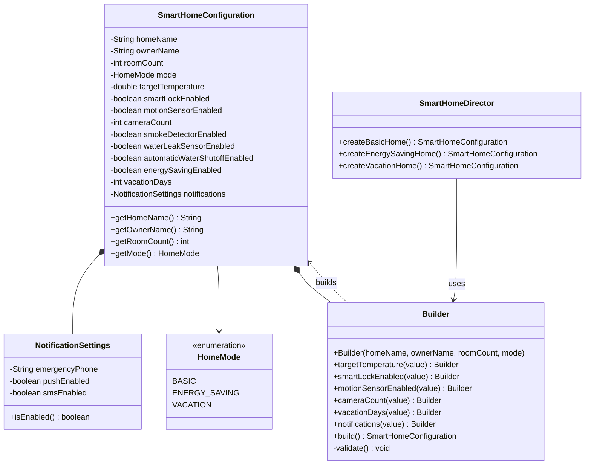

# Builder Pattern UML

```mermaid
classDiagram
    class SmartHomeConfiguration {
        -String homeName
        -String ownerName
        -int roomCount
        -HomeMode mode
        -double targetTemperature
        -boolean smartLockEnabled
        -boolean motionSensorEnabled
        -int cameraCount
        -boolean smokeDetectorEnabled
        -boolean waterLeakSensorEnabled
        -boolean automaticWaterShutoffEnabled
        -boolean energySavingEnabled
        -int vacationDays
        -NotificationSettings notifications
        +getHomeName() String
        +getOwnerName() String
        +getRoomCount() int
        +getMode() HomeMode
    }

    class Builder {
        +Builder(homeName, ownerName, roomCount, mode)
        +targetTemperature(value) Builder
        +smartLockEnabled(value) Builder
        +motionSensorEnabled(value) Builder
        +cameraCount(value) Builder
        +vacationDays(value) Builder
        +notifications(value) Builder
        +build() SmartHomeConfiguration
        -validate() void
    }

    class NotificationSettings {
        -String emergencyPhone
        -boolean pushEnabled
        -boolean smsEnabled
        +isEnabled() boolean
    }

    class HomeMode {
        <<enumeration>>
        BASIC
        ENERGY_SAVING
        VACATION
    }

    class SmartHomeDirector {
        +createBasicHome() SmartHomeConfiguration
        +createEnergySavingHome() SmartHomeConfiguration
        +createVacationHome() SmartHomeConfiguration
    }

    SmartHomeConfiguration *-- NotificationSettings
    SmartHomeConfiguration --> HomeMode
    SmartHomeConfiguration *-- Builder
    Builder ..> SmartHomeConfiguration : builds
    SmartHomeDirector --> Builder : uses
```